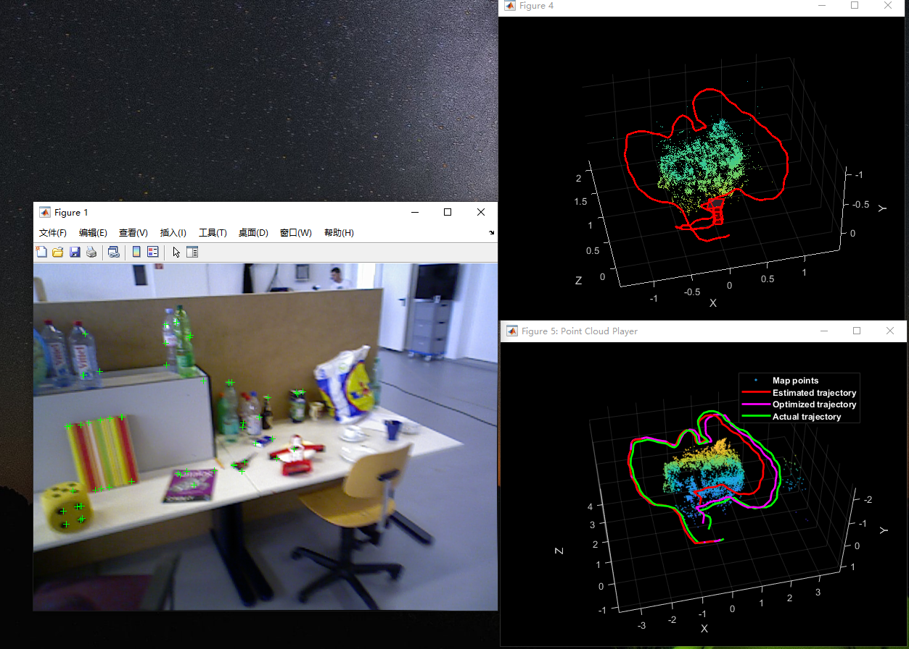
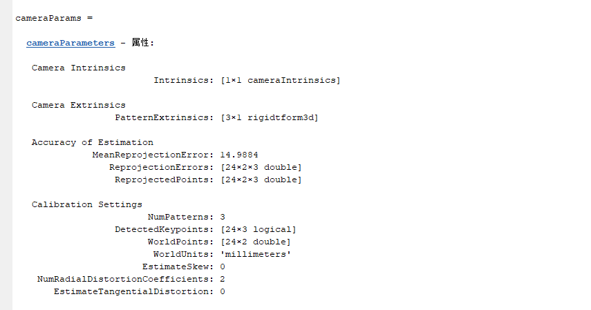
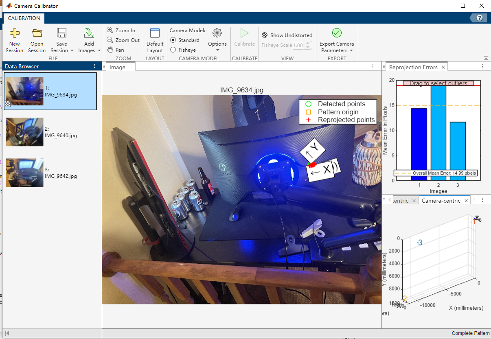
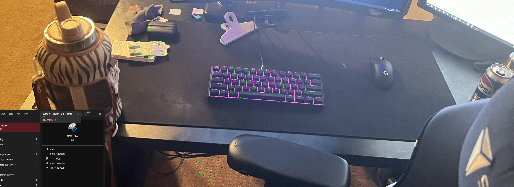
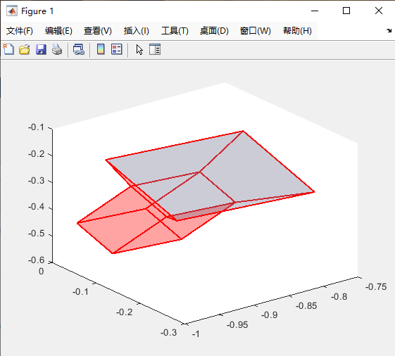

# Build-a-SLAM-Application
Summary of the Monocular Visual SLAM Implementation: The Monocular Visual SLAM1 process involves the following key steps:

Map Initialization: The map of 3-D world points is initialized using two frames. Depending on whether the scene is planar or non-planar, a homography projective transformation or a fundamental matrix is used to describe feature point correspondences.
Tracking: Once a map is initialized, for each new frame, the camera pose is estimated by matching features in the current frame to features in the last key frame. The estimated camera pose is refined by tracking the local map.
Local Mapping: The current frame is used to create new 3-D map points if it is identified as a key frame. At this stage, bundle adjustment is used to minimize reprojection errors by adjusting the camera pose and 3-D points.
Loop Closure: Loops are detected for each key frame by comparing it against all previous key frames using the bag-of-features approach. Once a loop closure is detected, the pose graph is optimized to refine the camera poses of all the key frames.
Optimizing Poses: A similarity pose graph optimization is performed over the essential graph in vSetKeyFrames to correct the drift of camera poses. The essential graph is created internally by removing connections with fewer than minNumMatches matches in the covisibility graph. After similarity pose graph optimization, update the 3-D locations of the map points using the optimized poses and the associated scales.

Results

Discussion on Implementing a Visual SLAM Application: Implementing a visual SLAM application would involve the following steps:
Sensor Selection: 

Depending on the application, i might choose to use a monocular camera, stereo camera, or RGB-D camera. Each sensor type has its advantages and disadvantages. For example, a monocular camera is low-cost and can be used in a wide range of environments, but it cannot directly measure depth.
Feature Extraction and Matching: i would need to choose an appropriate feature extraction and matching algorithm. ORB (Oriented FAST and Rotated BRIEF) is a good choice due to its efficiency and robustness to changes in viewpoint and lighting.
Map Initialization and Tracking: Similar to the example, i would need to initialize a map using the first few frames and then track the camera pose in subsequent frames by matching features to the map.
Local Mapping and Loop Closure: As new key frames are added, i would update the map and look for loop closures to correct drift in the camera trajectory.
Optimization: Finally, it would perform global optimization (such as bundle adjustment or pose graph optimization) to refine the map and camera trajectory.
Integration with Other Systems: Depending on your application, you might also need to integrate your visual SLAM system with other systems. For example, in a robot navigation application, you would need to integrate with path planning and control systems.

Step 2 code:

cameraCalibrator

imds = imageDatastore('C:\Users\evanh\OneDrive\Documents\MATLAB');

reset(imds);  

disp(['Number of images in the datastore: ' num2str(numel(imds.Files))]);

if numel(imds.Files) == 0

    error('No images found in the specified directory.');
    
end

firstImage = readimage(imds, 1);

imageSize = size(firstImage);

imagePlayer = vision.VideoPlayer('Position', [100 100 [imageSize(2), imageSize(1)]+30]);

grayImage = rgb2gray(firstImage);

points = detectMinEigenFeatures(grayImage, 'MinQuality', 0.01);

tracker = vision.PointTracker('MaxBidirectionalError', 2);

initialize(tracker, points.Location, grayImage);

while hasdata(imds)

    frame = read(imds);  
    
    grayFrame = rgb2gray(frame);
    
    
    [points, validity] = step(tracker, grayFrame);
    
    
    out = insertMarker(frame, points(validity, :), '+');
    step(imagePlayer, out);
    
    
    if nnz(validity) < 10
        release(tracker);
        points = detectMinEigenFeatures(grayFrame, 'MinQuality', 0.01);
        initialize(tracker, points.Location, grayFrame);
    end
    
end

image1 = readimage(imds, 1);

image2 = readimage(imds, 2);

points1 = detectSURFFeatures(rgb2gray(image1));

points2 = detectSURFFeatures(rgb2gray(image2));

[features1, validPoints1] = extractFeatures(rgb2gray(image1), points1);

[features2, validPoints2] = extractFeatures(rgb2gray(image2), points2);

indexPairs = matchFeatures(features1, features2);

matchedPoints1 = validPoints1(indexPairs(:, 1), :);

matchedPoints2 = validPoints2(indexPairs(:, 2), :);

[fMatrix, epipolarInliers] = estimateFundamentalMatrix(...

    matchedPoints1, matchedPoints2, 'Method', 'RANSAC', ...
    'NumTrials', 10000, 'DistanceThreshold', 0.1);

inlierPoints1 = matchedPoints1(epipolarInliers, :);

inlierPoints2 = matchedPoints2(epipolarInliers, :);

[orientation, location] = relativeCameraPose(fMatrix, cameraParams, ...

    inlierPoints1, inlierPoints2);
cameraPose = rigid3d(orientation, location);

figure;

plotCamera('Location', location, 'Orientation', orientation, 'Size', 0.1);

hold on;

Result:

